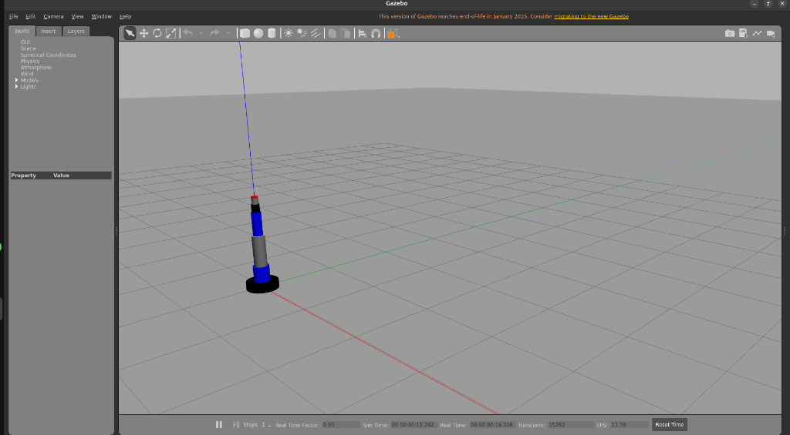
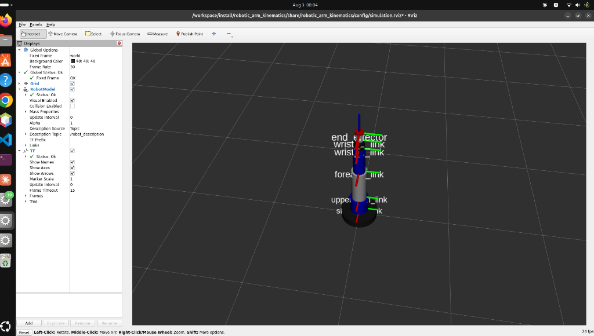

# Project 1: Robotic Arm Kinematics & Path Planning

This ROS 2 package simulates a 6-DOF industrial manipulator, resolves inverse kinematics (IK) in real-time, generates smooth collision-free paths, and controls the arm dynamically inside a Gazebo and RViz simulation.

---

## Features

1. **TRAC-IK Solver**: Resolves inverse kinematics using `trac_ik_lib` (a hybrid SQP + Jacobian pseudo-inverse solver) operating in `Distance` mode to minimize joint displacement and avoid singularities.
2. **MoveIt & FCL Collision Checking**: Inspects self-collisions and environment collisions inside a `planning_scene::PlanningScene` powered by the Flexible Collision Library (FCL).
3. **Quintic Spline Trajectory**: Interposes waypoints using a 5th-order polynomial (quintic) path to ensure position $q(t)$, velocity $\dot{q}(t)$, and acceleration $\ddot{q}(t)$ continuity.
4. **FollowJointTrajectory Action Client**: Connects to control managers asynchronously using joint trajectory action goals.
5. **Safety Monitors & Resource Locks**:
   * **Resource Lock**: Rejects conflicting trajectory commands while the arm is moving.
   * **Dynamic Interception**: Evaluates remaining trajectory waypoints against obstacles at 20 Hz, cancelling execution goals immediately if an obstacle intercepts the path mid-flight.

---

## Simulation Results

Below are screenshots of the running simulation with the 6-DOF robotic manipulator rendering and executing trajectories:

### Gazebo Simulation
The arm is fully spawned in Gazebo with visual shapes, joint linkages, and dynamic controllers:


### RViz2 Visualization & TF Frames
The planner node tracks link transforms (TF frames) and displays joint constraints relative to the `world` coordinate frame:


---

## Execution Options

### Option A: Run via Docker (Recommended for Ubuntu 26.04)

Since ROS 2 is not pre-packaged natively for Ubuntu 26.04, running inside a Docker container with GUI socket forwarding is the most robust and straightforward approach.

1. **Verify X11 Permissions & Start the Container**:
   Run the pre-configured run script from this directory. It automatically configures local X11 display authorities and launches the container:
   ```bash
   cd "/home/ikram/DecodeLabs Internship/Project 1"
   ./run_docker.sh
   ```
   *(This builds the Docker image and launches Gazebo, RViz, and the Kinematics node. Graphical windows will automatically render on your desktop)*

2. **Publish Target Pose (Sending commands to the container)**:
   In a new terminal window on your host system, access the running container's bash environment to source the paths and send a coordinate:
   ```bash
   # Enter the running simulation container
   docker exec -it robotic_arm_simulation bash

   # Publish a goal coordinate (XYZ: 0.35, 0.15, 0.45)
   ros2 topic pub -1 /target_pose geometry_msgs/msg/PoseStamped "{
     header: {
       frame_id: 'base_link'
     },
     pose: {
       position: {x: 0.35, y: 0.15, z: 0.45},
       orientation: {x: 0.0, y: 0.707, z: 0.0, w: 0.707}
     }
   }"
   ```

---

### Option B: Native ROS 2 Installation (For systems with ROS 2 pre-installed)

If you are running on a machine with ROS 2 (Humble/Jazzy) installed natively:

1. **Workspace Setup**:
   ```bash
   mkdir -p ~/robotic_arm_ws/src
   cd ~/robotic_arm_ws/src
   cp -r "/home/ikram/DecodeLabs Internship/Project 1" ./robotic_arm_kinematics
   ```

2. **Install Dependencies**:
   ```bash
   cd ~/robotic_arm_ws
   sudo apt update
   rosdep update
   rosdep install --from-paths src --ignore-src -r -y
   ```

3. **Build & Source**:
   ```bash
   colcon build --symlink-install
   source install/setup.bash
   ```

4. **Launch**:
   ```bash
   ros2 launch robotic_arm_kinematics simulation.launch.py
   ```

5. **Send Target Pose**:
   In another terminal, source the workspace overlay and run:
   ```bash
   source ~/robotic_arm_ws/install/setup.bash
   
   ros2 topic pub -1 /target_pose geometry_msgs/msg/PoseStamped "{
     header: {
       frame_id: 'base_link'
     },
     pose: {
       position: {x: 0.35, y: 0.15, z: 0.45},
       orientation: {x: 0.0, y: 0.707, z: 0.0, w: 0.707}
     }
   }"
   ```

---

## File Structure

```text
Project 1/
├── package.xml                   # ROS 2 dependency metadata
├── CMakeLists.txt                # Build configuration and executable compilation rules
├── README.md                     # This documentation file
├── Dockerfile                    # Container definition (ROS 2 Humble + dependencies)
├── docker-compose.yml            # Docker Compose configuration with GUI forwarding volume mounts
├── run_docker.sh                 # Authorizes X11 and runs docker compose
├── urdf/
│   └── robot_arm.urdf.xacro      # 6-DOF Xacro manipulator with Inertial, Gazebo, and ros2_control tags
├── config/
│   ├── ros2_controllers.yaml     # Controller settings (broadcaster, trajectory, joint PID gains)
│   └── simulation.rviz           # RViz2 visualization setup
├── launch/
│   └── simulation.launch.py      # Unified simulation launcher (Gazebo, RViz, Spawners, and Planner)
└── src/
    └── kinematics_planner_node.cpp # C++ Kinematics, Collision Scene, Splining, and Action client node
```
